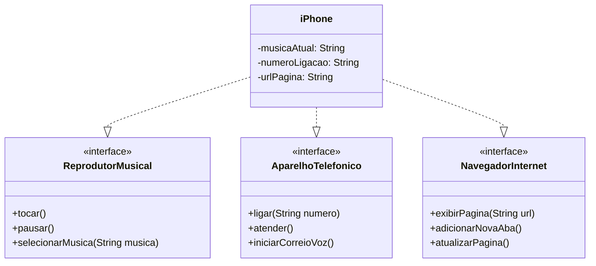

## Contexto do Projeto

O desafio proposto era colocar em prática toda a concepção de análise de negócios, requisitos, conceitos da programação orientada a objetos e modelagem UML. 
Com base no vídeo de lançamento do iPhone conforme link abaixo, elaborar em uma ferramenta de UML a diagramação das classes e interfaces com a proposta de representar os papéis do iPhone de: Reprodutor Musical, Aparelho Telefônico e Navegador na Internet. 
Em seguida criar as classes e interfaces no formato de arquivos java.

[Lançamento iPhone 2017](https://www.youtube.com/watch?v=9ou608QQRq8)

#### Funcionalidades a Modelar
1. **Reprodutor Musical**
   - Métodos: `tocar()`, `pausar()`, `selecionarMusica(String musica)`
2. **Aparelho Telefônico**
   - Métodos: `ligar(String numero)`, `atender()`, `iniciarCorreioVoz()`
3. **Navegador na Internet**
   - Métodos: `exibirPagina(String url)`, `adicionarNovaAba()`, `atualizarPagina()`

## Diagrama de Classe

